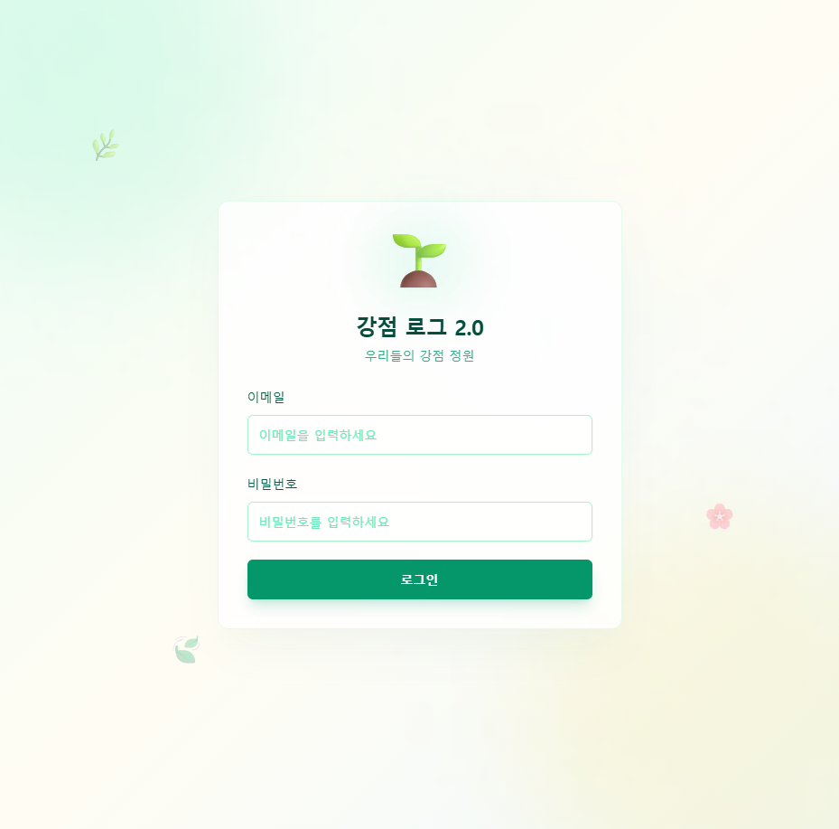
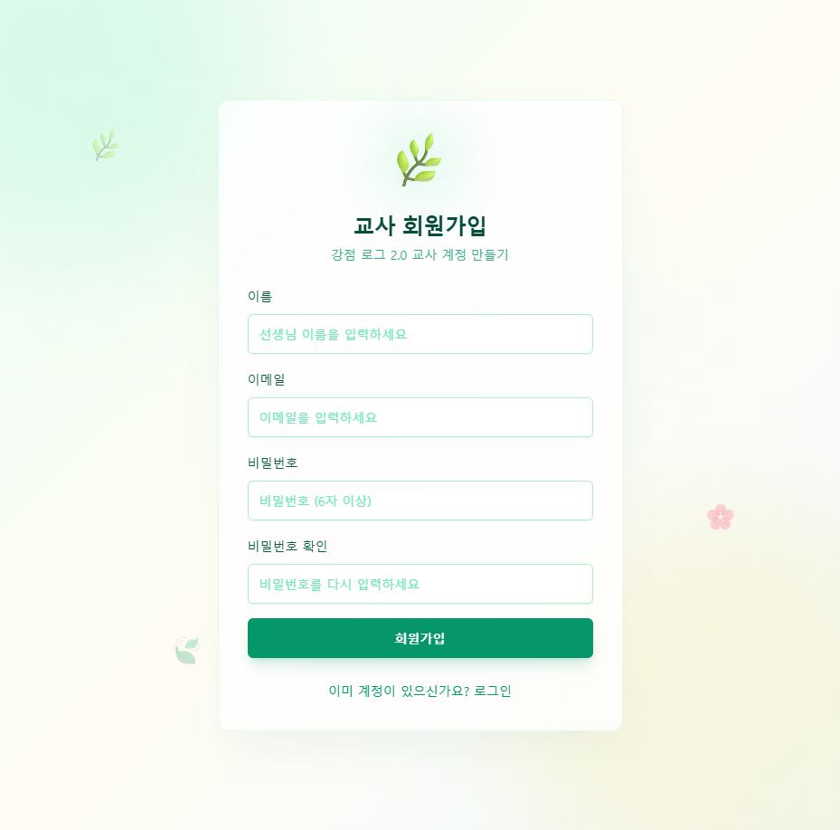

# 🌱 강점 로그 2.0 — 우리들의 강점 정원

> 교사가 AI와 함께 직접 만든, 학생 강점 관찰 및 생활기록부 초안 자동 생성 웹앱

**아이스크림 바이브코딩 공모전 출품작**

---

## 📋 프로젝트 개요

### 문제: 생기부 작성, 매년 반복되는 부담

초등학교 담임교사에게 생활기록부의 '행동특성 및 종합의견' 작성은 매년 찾아오는 큰 숙제입니다. 학급 학생 수가 20명을 넘으면, 한 명 한 명의 특성을 기억하고 400~500자 분량의 문장을 개별 작성하는 일은 상당한 시간과 에너지를 요구합니다. 관찰 기록을 꼼꼼히 남기고 싶어도, 수업과 생활지도 사이에서 그 시간을 내기가 쉽지 않습니다.

### 해결: 학생이 참여하고, AI가 정리하는 강점 관찰 시스템

**강점 로그 2.0**은 이 문제를 두 가지 방향에서 풀어냅니다.

첫째, 관찰 기록을 교사 혼자 쌓지 않습니다. 학생들이 스스로 자신의 강점을 기록하고, 친구에게 강점 선물을 보내며, 교사는 그 기록들을 검토·승인하는 구조입니다. 학급 전체가 함께 강점 데이터를 만들어 갑니다.

둘째, 쌓인 기록을 AI가 생기부 초안으로 정리해 줍니다. 교사의 관찰 기록과 승인된 친구 기록을 바탕으로 Google Gemini가 실제 생기부 문체에 맞는 초안을 생성합니다. 교사는 초안을 검토하고 다듬는 데만 집중하면 됩니다.

**핵심 가치:**
- 교사의 생기부 작성 부담을 AI로 해소
- 학생이 직접 참여하는 강점 관찰 시스템
- 교사별 독립 운영 (각 교사 계정이 자신의 학급을 독립적으로 관리)
- 실제 교실에서 바로 사용 가능한 완성형 서비스

---

## ✨ 주요 기능

### 선생님 모드

| 기능 | 설명 |
|------|------|
| 학급 대시보드 | 학생 전체의 강점 기록 누적 현황을 카드 형태로 한눈에 확인 |
| 관찰 기록 입력 | 학생을 선택하고 강점 카테고리와 구체적 사례를 즉시 기록 |
| 승인함 | 학생들이 작성한 '친구 선물(Peer-Log)'을 검토하고 승인 또는 반려 |
| AI 생기부 생성 | 교사 기록 + 승인된 친구 기록을 합산해 생기부 초안 자동 생성 |
| 설정 | 학생 명단 관리 및 Gemini API 키 설정 |

### 학생 모드

| 기능 | 설명 |
|------|------|
| 나의 강점 정원 | 내가 받은 강점 기록들이 꽃으로 피어나는 정원 화면 |
| 자기 기록 (Self Log) | 오늘 내가 발휘한 강점을 스스로 기록 |
| 친구 선물 (Peer Gift) | 친구에게 강점 아이콘과 칭찬 메시지를 선물로 전달 |
| 강점 사전 | VIA 24개 강점의 뜻과 예시 문구를 팝업으로 확인 |

### VIA 24 강점 체계

6개 덕목(지혜, 용기, 사랑, 정의, 절제, 초월) 아래 24개 강점을 보석 아이콘으로 시각화합니다. 학생들이 추상적인 강점 개념을 직관적으로 이해하고 선택할 수 있도록 설계했습니다.

---

## 🛠 기술 스택

| 분류 | 기술 | 역할 |
|------|------|------|
| 프레임워크 | Next.js 14 (App Router) | 풀스택 웹 애플리케이션 |
| 스타일링 | Tailwind CSS + Shadcn UI | 반응형 UI 컴포넌트 |
| 인증 및 데이터베이스 | Firebase Auth + Firestore | 교사/학생 계정 관리, 실시간 데이터 저장 |
| AI 엔진 | Google Gemini 1.5 Pro API | 생활기록부 초안 자동 생성 |
| 배포 | Vercel | 서버리스 배포 및 운영 |
| 아이콘 | Lucide React | UI 아이콘 |

---

## 📸 스크린샷

### 메인 화면



### 학생 등록 및 강점 진단



---

## 🏗 시스템 구조

```
사용자 (교사 / 학생)
    │
    ▼
Next.js 14 웹앱 (Vercel 배포)
    │
    ├── Firebase Authentication  ← 교사/학생 계정 분리 로그인
    │
    ├── Cloud Firestore          ← 관찰 기록, 강점 데이터 저장
    │       │
    │       └── 교사별 독립 데이터 구조 (멀티테넌트)
    │
    └── Google Gemini API        ← 생기부 초안 생성 (서버사이드 호출)
```

데이터는 교사 계정 단위로 완전히 분리됩니다. 한 교사의 학급 데이터는 다른 교사에게 노출되지 않으며, 각 교사가 자신의 학급을 독립적으로 운영합니다.

---

## 🤖 AI 활용: 생기부 초안 자동 생성

이 프로젝트의 핵심 기능입니다.

교사가 'AI 생기부 생성' 버튼을 누르면, 해당 학생에 대해 쌓인 두 가지 데이터가 Gemini에 전달됩니다.

- **교사 관찰 기록**: 교사가 직접 입력한 구체적 사례들
- **승인된 친구 기록**: 교사가 검토·승인한 또래 평가들

Gemini는 이 데이터를 바탕으로 실제 생기부 문체("~함, ~임" 형태의 개조식)에 맞는 400~500자 초안을 생성합니다. 친구들의 평가는 "동료 학생들로부터 ~라는 긍정적인 평가를 받음" 형태로 자연스럽게 녹아듭니다.

학생 본인이 작성한 자기 기록은 AI 생성에 사용하지 않습니다. 교사의 전문적 관찰과 또래의 시선만을 반영하여 생기부의 신뢰성을 유지합니다.

교사는 AI가 생성한 초안을 그대로 쓰는 것이 아니라, 자신의 언어로 다듬는 출발점으로 활용합니다. AI는 교사의 판단을 대체하는 것이 아니라, 기록을 정리하고 문장을 구성하는 수고를 덜어주는 도구입니다.

---

## 🚀 배포

서비스는 현재 Vercel에 배포되어 누구나 접속할 수 있습니다.

**라이브 서비스:** [https://strength-log-eta.vercel.app](https://strength-log-eta.vercel.app)

**GitHub 저장소:** [https://github.com/jeongdon-heo/strength-log](https://github.com/jeongdon-heo/strength-log)

---

## 💡 바이브코딩 개발 과정

이 프로젝트는 교사가 AI 도구와 함께 직접 기획하고 개발한 결과물입니다.

### 기획: 교실의 문제에서 출발

생기부 작성 시즌마다 느끼던 막막함이 출발점이었습니다. "학생들의 강점을 더 체계적으로 관찰하고 싶다", "기록이 쌓이면 AI가 정리해 줄 수 있지 않을까"라는 생각을 Claude와의 대화로 구체화했습니다. 기능 목록을 나열하고, 데이터 구조를 함께 설계하고, 어떤 화면이 필요한지 하나씩 정리했습니다. 기획 문서(PROJECT_SPEC.md)도 AI와 함께 작성했습니다.

### 개발: 모르는 것을 물어가며

Next.js App Router의 서버 컴포넌트 개념, Firebase Firestore의 보안 규칙, Gemini API의 프롬프트 설계까지, 처음 접하는 기술들을 Claude와 Cursor를 통해 하나씩 배워가며 구현했습니다. 코드가 예상대로 동작하지 않을 때는 오류 메시지를 그대로 붙여넣고 원인을 물었습니다. AI는 단순히 코드를 생성해 주는 것이 아니라, 왜 그렇게 작동하는지 설명해 주는 동료 같은 역할을 했습니다.

특히 생기부 생성 프롬프트를 다듬는 과정이 흥미로웠습니다. 처음 생성된 문장이 생기부 문체와 맞지 않아 여러 차례 프롬프트를 수정했고, 실제 생기부 예시를 참고해 AI에게 문체 규칙을 명확히 전달하는 방법을 찾아갔습니다.

### 배포: 교실에서 바로 쓸 수 있도록

Vercel을 통한 배포도 AI의 도움으로 처음 시도했습니다. 환경 변수 설정, Firebase 보안 규칙 적용, 도메인 연결까지 단계별로 안내를 받으며 진행했습니다. 개발 환경에서만 돌아가는 프로토타입이 아니라, 실제 학급에서 바로 사용할 수 있는 서비스로 완성하는 것이 목표였습니다.

### 바이브코딩이 가능하게 한 것

코딩 전문가가 아닌 교사가 이 수준의 웹앱을 만들 수 있었던 것은 AI 도구 덕분입니다. 동시에, AI가 어떤 기능이 교실에서 실제로 필요한지는 알 수 없었습니다. 교사의 현장 경험과 AI의 기술 구현 능력이 만나는 지점에서 이 프로젝트가 만들어졌습니다. 바이브코딩은 교사가 기술의 소비자가 아니라 창작자가 될 수 있게 해주는 방식이라고 생각합니다.

---

## 📦 설치 및 실행

로컬 환경에서 직접 실행하려면 아래 순서를 따르세요.

**1. 저장소 클론 및 패키지 설치**

```bash
git clone https://github.com/jeongdon-heo/strength-log.git
cd strength-log
npm install
```

**2. 환경 변수 설정**

프로젝트 루트에 `.env.local` 파일을 생성하고 Firebase 프로젝트 설정값과 Gemini API 키를 입력합니다. 필요한 환경 변수 목록은 `.env.local.example` 파일을 참고하세요.

**3. 개발 서버 실행**

```bash
npm run dev
```

브라우저에서 [http://localhost:3000](http://localhost:3000)으로 접속합니다.

---

## 👨‍🏫 만든 사람

**허정돈**

초등학교 교사. 교실에서 느낀 문제를 AI와 함께 직접 해결해 보고자 이 프로젝트를 만들었습니다.

---

*아이스크림 바이브코딩 공모전 출품작 | 2026*
